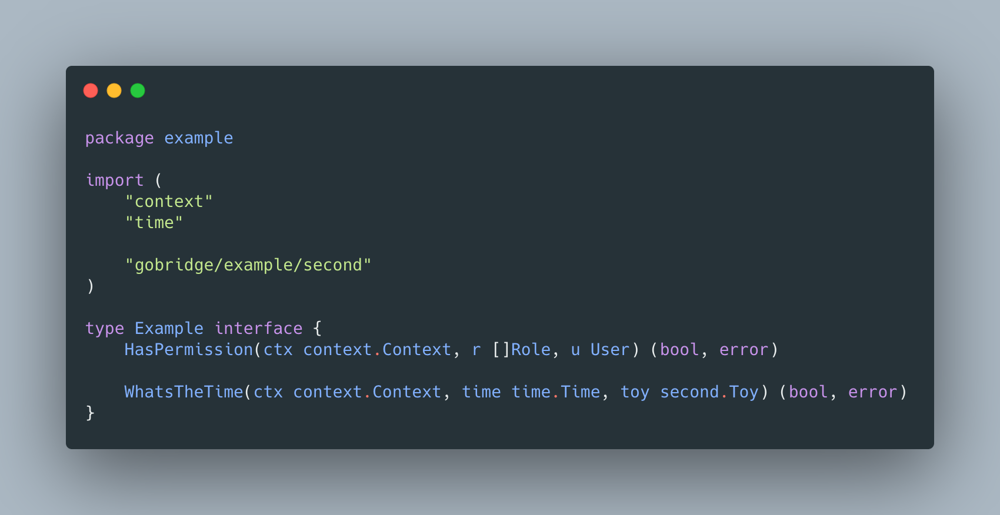
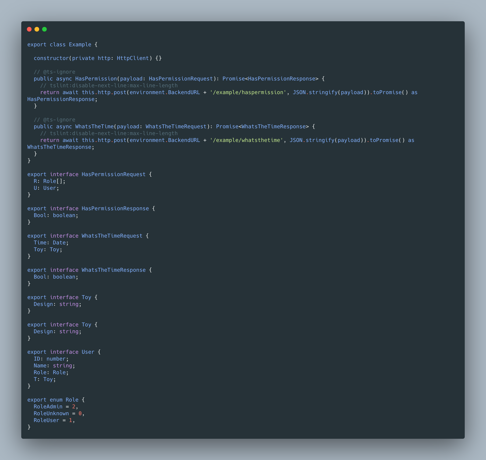
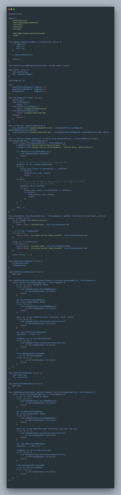

# gobridge



# What is GoBridge
#### GoBridge is a client code generation for HTTP in situations where gRPC is not desired. Currently Angular (typescipt) is only supported client application.

# Tutorial:
#### 1. Clone the repo or copy the binary directly from ./bin/
git clone https://github.com/luno/gobridge.git

#### 2. Run & have fun!
```shell script
go run main.go --api="./example/backend" --mod="github.com/luno/gobridge" --ts="./example/frontend/services/example.ts" --ts_service="Example" --server="./example/backend/server/server_gen.go"
```

#### 4. It will take delcarations like this:


#### GoBridge will output this for Angular (typescript)


#### GoBridge will output this as the server side implementation
